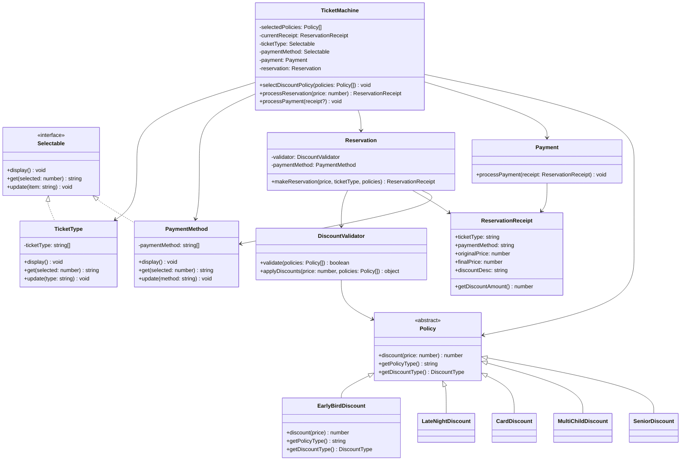

# 🎫 티켓 예약 시스템 - OOP 학습 프로젝트

객체지향 프로그래밍(OOP)의 핵심 원칙과 디자인 패턴을 학습하기 위한 티켓 예약 시스템입니다.

## 📋 목차
- [시스템 구조](#시스템-구조)
- [클래스 다이어그램](#클래스-다이어그램)
- [SOLID 원칙 적용](#solid-원칙-적용)
- [디자인 패턴](#디자인-패턴)
- [실행 방법](#실행-방법)

---

## 🏗️ 시스템 구조

### 핵심 클래스

```
TicketMachine (파사드)
├── TicketType (티켓 종류 관리)
├── PaymentMethod (결제 수단 관리)
├── Reservation (예약 처리)
└── Payment (결제 처리)

Policy (할인 정책)
├── EarlyBirdDiscount (조조할인)
├── LateNightDiscount (심야할인)
├── CardDiscount (카드할인)
├── MultiChildDiscount (다자녀할인)
└── SeniorDiscount (경로우대)

ReservationReceipt (예약 영수증)
```

---

## 📊 클래스 다이어그램



---

## 🎯 SOLID 원칙 적용

### 1️⃣ SRP (Single Responsibility Principle) - 단일 책임 원칙

**각 클래스는 하나의 책임만 가집니다.**

```typescript
// ✅ 좋은 예: 각 클래스가 명확한 단일 책임을 가짐
class TicketType {
    // 책임: 티켓 종류 관리만
}

class Reservation {
    // 책임: 예약 처리 및 영수증 생성만
}

class Payment {
    // 책임: 결제 처리만
}

class DiscountValidator {
    // 책임: 할인 정책 검증만
}
```

**적용 부분:**
- `TicketType`: 티켓 종류 관리
- `PaymentMethod`: 결제 수단 관리
- `Reservation`: 예약 및 할인 적용
- `Payment`: 결제 처리
- `DiscountValidator`: 할인 정책 검증
- `ReservationReceipt`: 예약 정보 보관

---

### 2️⃣ OCP (Open-Closed Principle) - 개방-폐쇄 원칙

**확장에는 열려있고, 수정에는 닫혀있습니다.**

```typescript
// ✅ 새로운 할인 정책 추가 시 기존 코드 수정 불필요
abstract class Policy {
    abstract discount(price: number): number
    abstract getPolicyType(): string
    abstract getDiscountType(): DiscountType
}

// 새로운 할인 추가 - 기존 코드 수정 없음
class StudentDiscount extends Policy {
    getPolicyType() { return '학생할인'; }
    getDiscountType() { return DiscountType.PERCENTAGE; }
    discount(price: number) { return price * 0.8; }
}
```

**적용 부분:**
- `Policy` 추상 클래스를 상속하여 새 할인 정책 추가 가능
- `Selectable` 인터페이스를 구현하여 새로운 선택 목록 추가 가능

---

### 3️⃣ LSP (Liskov Substitution Principle) - 리스코프 치환 원칙

**하위 타입은 상위 타입을 대체할 수 있어야 합니다.**

```typescript
// ✅ 모든 Policy 하위 클래스는 동일한 인터페이스 제공
function applyDiscount(policy: Policy, price: number): number {
    return policy.discount(price); // 어떤 Policy든 동일하게 작동
}

// 어떤 할인 정책이든 교체 가능
const discount1: Policy = new EarlyBirdDiscount();
const discount2: Policy = new CardDiscount();
```

**적용 부분:**
- 모든 `Policy` 구현체는 `discount()` 메서드 제공
- 모든 `Selectable` 구현체는 `display()`, `get()`, `update()` 제공

---

### 4️⃣ ISP (Interface Segregation Principle) - 인터페이스 분리 원칙

**클라이언트는 사용하지 않는 인터페이스에 의존하지 않아야 합니다.**

```typescript
// ✅ 선택 가능한 목록에만 필요한 인터페이스
interface Selectable {
    display(): void;
    get(selected: number): string | undefined;
    update(item: string): void;
}

// ❌ 나쁜 예: 불필요한 메서드 강제
interface BadInterface {
    display(): void;
    get(): string;
    validate(): boolean;  // 모든 구현체가 필요한 건 아님
    calculate(): number;  // 불필요
}
```

**적용 부분:**
- `Selectable`: 선택 목록 관리에만 필요한 메서드
- `Policy`: 할인 정책에만 필요한 메서드

---

### 5️⃣ DIP (Dependency Inversion Principle) - 의존성 역전 원칙

**구체적인 것이 아닌 추상적인 것에 의존해야 합니다.**

```typescript
// ✅ 인터페이스에 의존
class TicketMachine {
    constructor(
        private ticketType: Selectable,      // 구체 클래스 X, 인터페이스 O
        private paymentMethod: Selectable,   // 구체 클래스 X, 인터페이스 O
        private payment: Payment,
        private reservation: Reservation
    ){}
}

// ❌ 나쁜 예: 구체 클래스에 직접 의존
class BadTicketMachine {
    constructor(
        private ticketType: TicketType,      // 구체 클래스에 의존
        private paymentMethod: PaymentMethod // 구체 클래스에 의존
    ){}
}
```

**적용 부분:**
- `TicketMachine`이 `Selectable` 인터페이스에 의존
- `Reservation`이 `Policy` 추상 클래스에 의존

---

## 🎨 디자인 패턴

### 1. Strategy Pattern (전략 패턴)

**할인 정책을 전략으로 캡슐화**

```typescript
// 전략 인터페이스
abstract class Policy {
    abstract discount(price: number): number
}

// 구체적인 전략들
class EarlyBirdDiscount extends Policy { ... }
class CardDiscount extends Policy { ... }

// 전략 사용
ticketMachine.selectDiscountPolicy([new EarlyBirdDiscount()]);
```

### 2. Template Method Pattern (템플릿 메서드 패턴)

**할인 적용의 기본 흐름을 정의**

```typescript
abstract class Policy {
    abstract discount(price: number): number  // 하위 클래스가 구현
    abstract getPolicyType(): string
    abstract getDiscountType(): DiscountType
}
```

### 3. Facade Pattern (파사드 패턴)

**복잡한 시스템을 단순한 인터페이스로 제공**

```typescript
class TicketMachine {
    // 복잡한 내부 시스템을 간단한 인터페이스로 제공
    selectDiscountPolicy(policies: Policy[]) { ... }
    processReservation(price: number) { ... }
    processPayment() { ... }
}
```

### 4. Data Transfer Object (DTO 패턴)

**예약 정보를 객체로 전달**

```typescript
class ReservationReceipt {
    constructor(
        public readonly ticketType: string,
        public readonly paymentMethod: string,
        public readonly originalPrice: number,
        public readonly finalPrice: number,
        public readonly discountDesc: string
    ) {}
}
```

---

## 🔄 데이터 흐름

```
사용자
  ↓
[1] TicketMachine.selectDiscountPolicy([policies])
  ↓
[2] TicketMachine.processReservation(price)
  ↓
Reservation.makeReservation()
  ↓
DiscountValidator.applyDiscounts()
  ↓
ReservationReceipt 생성
  ↓
[3] TicketMachine.processPayment()
  ↓
Payment.processPayment(receipt)
  ↓
결제 완료 ✅
```

---

## 💡 주요 특징

### 1. 할인 정책 검증
```typescript
// 정액끼리만, 정률끼리만 중복 가능
정액 + 정액 ✅  (조조 + 심야)
정률 + 정률 ✅  (카드 + 경로우대)
정액 + 정률 ❌  (조조 + 카드)
```

### 2. 불변성 보장
```typescript
class ReservationReceipt {
    constructor(
        public readonly ticketType: string,  // readonly로 불변성 보장
        public readonly finalPrice: number
    ) {}
}
```

### 3. 타입 안정성
```typescript
enum DiscountType {
    FIXED,      // 정액 할인
    PERCENTAGE  // 정률 할인
}
```

---

## 🚀 실행 방법

```bash
# 1. 의존성 설치
npm install

# 2. 할인 정책 테스트
npm run dev src/01/discount_policy.ts

# 3. 전체 티켓 시스템 실행
npm run dev src/01/composition_interface_ticket.ts
```

---

## 📝 테스트 시나리오

### 케이스 1: 정액 할인
```typescript
ticketMachine.selectDiscountPolicy([
    new EarlyBirdDiscount(),  // -4,000원
    new LateNightDiscount()   // -3,000원
]);
ticketMachine.processReservation(10000);
ticketMachine.processPayment();

// 결과: 10,000 - 4,000 - 3,000 = 3,000원
```

### 케이스 2: 정률 할인
```typescript
ticketMachine.selectDiscountPolicy([
    new CardDiscount(),    // 30% 할인
    new SeniorDiscount()   // 50% 할인
]);
ticketMachine.processReservation(10000);
ticketMachine.processPayment();

// 결과: 10,000 * 0.7 * 0.5 = 3,500원
```

### 케이스 3: 혼합 할인 (실패)
```typescript
ticketMachine.selectDiscountPolicy([
    new EarlyBirdDiscount(),  // 정액
    new CardDiscount()         // 정률
]);
ticketMachine.processReservation(10000);

// 결과: ❌ 정액 할인과 정률 할인은 함께 사용할 수 없습니다.
```

---

## 🎓 학습 포인트

### OOP 4대 원칙
- ✅ **캡슐화**: private 속성, getter 메서드
- ✅ **상속**: Policy 추상 클래스 상속
- ✅ **다형성**: Policy 인터페이스로 다양한 할인 처리
- ✅ **추상화**: Selectable, Policy 인터페이스

### SOLID 원칙
- ✅ 각 클래스의 단일 책임
- ✅ 새 할인 정책 추가 시 기존 코드 수정 불필요
- ✅ 하위 클래스로 상위 클래스 대체 가능
- ✅ 필요한 인터페이스만 구현
- ✅ 구체 클래스가 아닌 인터페이스에 의존

### 디자인 패턴
- ✅ Strategy Pattern (할인 정책)
- ✅ Facade Pattern (TicketMachine)
- ✅ DTO Pattern (ReservationReceipt)

---

## 📂 파일 구조

```
src/01/
├── composition_ticket.ts              # 기본 컴포지션 패턴
├── composition_interface_ticket.ts    # 인터페이스 적용 버전
├── discount_policy.ts                 # 할인 정책 독립 테스트
└── README.md                          # 문서 (이 파일)
```

---

## 🔗 참고 자료

- [SOLID 원칙](https://en.wikipedia.org/wiki/SOLID)
- [디자인 패턴](https://refactoring.guru/design-patterns)
- [객체지향 프로그래밍](https://en.wikipedia.org/wiki/Object-oriented_programming)

---

**Made with ❤️ for OOP Learning**
